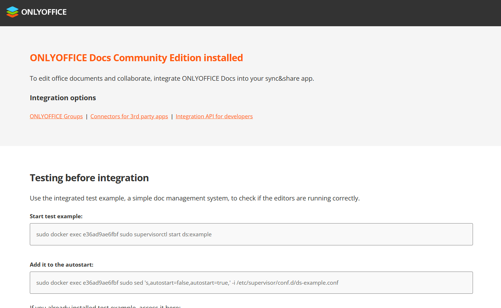
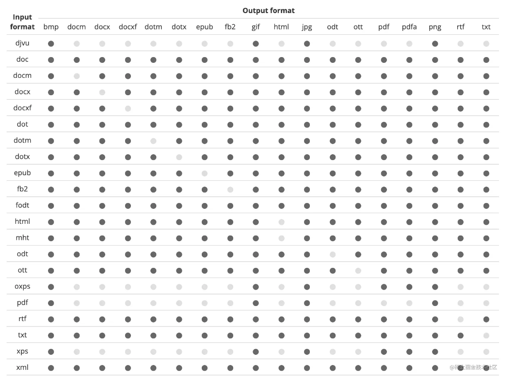
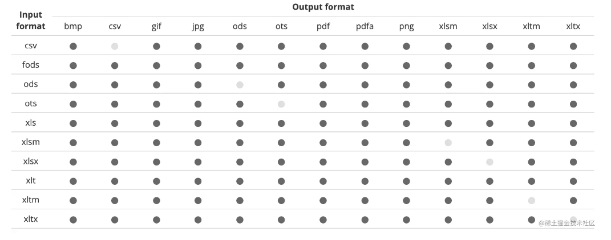
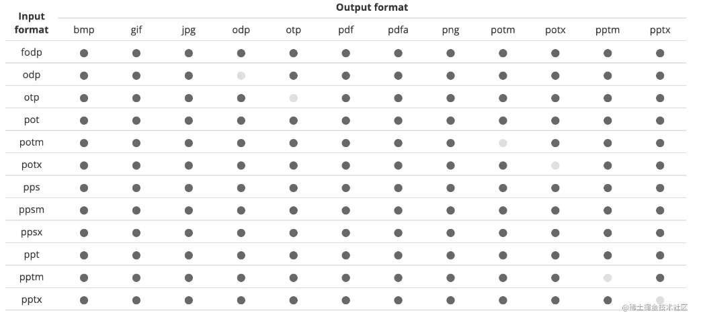
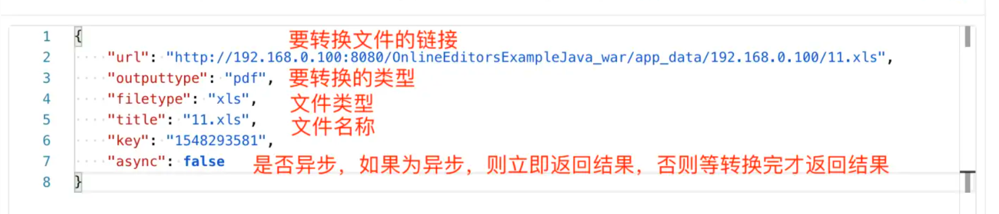
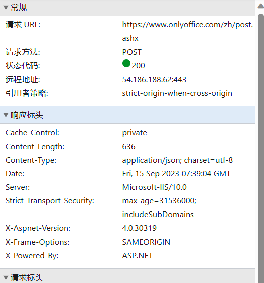
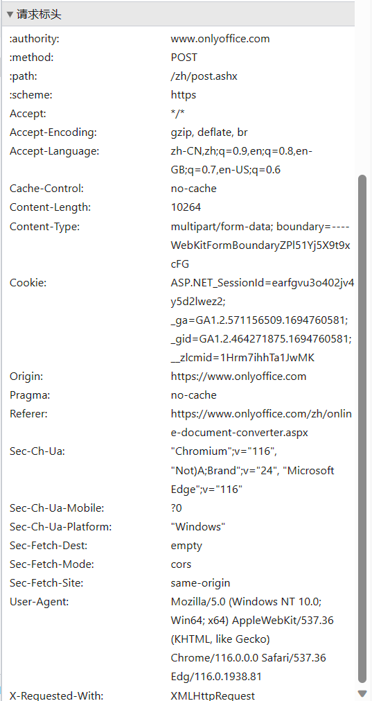
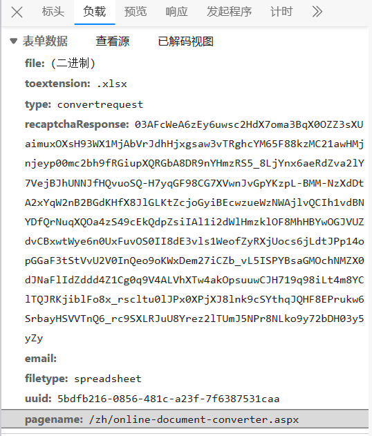

<h1 style="font-size:3.3em;color:skyblue;text-align:center">onlyoffice学习笔记</h1>


# 概述

**ONLYOFFICE Docs** 是一个在线办公套件，包括文本、电子表格和演示文稿的查看器和编辑器，完全兼容 Office Open XML 格式：.docx、.xlsx、.pptx，并支持实时协作编辑。


## 官网

https://www.onlyoffice.com/zh/

https://www.onlyoffice.org.cn/


## 功能

- 文档编辑器
- 电子表格编辑器
- 演示文稿编辑器
- 移动网络查看器
- 协作编辑
- 象形文字支持
- 支持所有流行的格式：DOC，DOCX，TXT，ODT，RTF，ODP，EPUB，ODS，XLS，XLSX，CSV，PPTX，HTML
- 格式转换


# 部署

## docker部署

### 拉取镜像

```sh
PS C:\Users\mao\Desktop> docker search onlyoffice/documentserver
NAME                                    DESCRIPTION                                      STARS     OFFICIAL   AUTOMATED
onlyoffice/documentserver               Feature-rich web-based office suite with a v…   323
onlyoffice/documentserver-ee                                                             2
onlyoffice/documentserver-de            ONLYOFFICE Developer Edition                     4                    [OK]
onlyoffice/documentserver-ie            ONLYOFFICE Integration Edition                   6                    [OK]
onlyoffice/documentserver-builder       Docker container for build sources from Docu…   3                    [OK]
onlyoffice/documentserver-integration                                                    2
onlyoffice/documentserver-ucs                                                            0
onlyoffice/documentserver-ee-ucs                                                         0
onlyoffice/documentserver-develop                                                        0
PS C:\Users\mao\Desktop> docker pull onlyoffice/documentserver
Using default tag: latest
latest: Pulling from onlyoffice/documentserver
f3ef4ff62e0d: Pull complete
d07cf79b5f7d: Pull complete
e5395a39b9a5: Pull complete
e6010a09edba: Pull complete
30fedd4b1d62: Pull complete
Digest: sha256:7e4a36f99966640fa7d0298ec3334309331229f61bdce7280667575ba9c8f7f6
Status: Downloaded newer image for onlyoffice/documentserver:latest
docker.io/onlyoffice/documentserver:latest

What's Next?
  View summary of image vulnerabilities and recommendations → docker scout quickview onlyoffice/documentserver
PS C:\Users\mao\Desktop>
```

```sh
PS C:\Users\mao\Desktop> docker images onlyoffice/documentserver
REPOSITORY                  TAG       IMAGE ID       CREATED         SIZE
onlyoffice/documentserver   latest    731f9669f88e   23 months ago   2.72GB
PS C:\Users\mao\Desktop>
```


### 运行容器

```sh
docker run -d -p 8147:80 --name onlyoffice -v D:/onlyoffice/logs:/var/log/onlyoffice -v D:/onlyoffice/data:/var/www/onlyoffice/Data  -v D:/onlyoffice/lib:/var/lib/onlyoffice -v D:/onlyoffice/db:/var/lib/postgresql -e JWT_ENABLED=false onlyoffice/documentserver
```


```sh
PS C:\Users\mao\Desktop> docker run -d -p 8147:80 --name onlyoffice -v D:/onlyoffice/logs:/var/log/onlyoffice -v D:/onlyoffice/data:/var/www/onlyoffice/Data  -v D:/onlyoffice/lib:/var/lib/onlyoffice -v D:/onlyoffice/db:/var/lib/postgresql -e JWT_ENABLED=false onlyoffice/documentserver
e36ad9ae6fbf544d3d2fac33e308685351129a34122cf4c08517468b12d46044
PS C:\Users\mao\Desktop> docker ps
CONTAINER ID   IMAGE                       COMMAND                   CREATED         STATUS         PORTS                               NAMES
e36ad9ae6fbf   onlyoffice/documentserver   "/app/ds/run-documen…"   7 seconds ago   Up 6 seconds   443/tcp, 0.0.0.0:8147->80/tcp       onlyoffice
ff059c2cfe45   7fff914c4a61                "/dashboard --insecu…"   23 hours ago    Up 23 hours                                        k8s_kubernetes-dashboard_kubernetes-dashboard-68955f84f4-ccwfd_kubernetes-dashboard_fd1c36df-d824-4d4f-a52a-a5f7152d8fa2_58
be3b667fd70a   7801cfc6d5c0                "/metrics-sidecar"        23 hours ago    Up 23 hours                                        k8s_dashboard-metrics-scraper_dashboard-metrics-scraper-748b4f5b9d-g4h26_kubernetes-dashboard_b76f2aa6-e30a-40f8-b865-2a9a97796ee0_31
54c91083e4ba   mysql:5.7                   "docker-entrypoint.s…"   2 weeks ago     Up 23 hours    33060/tcp, 0.0.0.0:3307->3306/tcp   mysql1
PS C:\Users\mao\Desktop>
```


### 访问

访问http://localhost:8147/


如果出现以下页面，则部署成功




## 本地部署

需要以下服务：

* PostgreSQL
* Redis
* RabbitMQ


下载链接：https://download.onlyoffice.com/install/documentserver/windows/onlyoffice-documentserver.exe


# 文档转换

## 转换列表

第一列是源格式，从第二列到最后一列是可以转换成的其他格式，其中深色圆点表示支持，浅色圆点表示不支持










## API 接口


请求的url：http://127.0.0.1:8147/ConvertService.ashx

请求方法：onlyoffice 版本在 4.2 之前使用的请求是 Get 类型，之后的版本使用的请求类型是 Post

请求参数：

|             属性参数              |                             描述                             | 数据类型 | 存在类型 |
| :-------------------------------: | :----------------------------------------------------------: | :------: | :------: |
|               Async               | 定义转换请求类型：异步与否。 支持的值： **true** **false** 当使用异步请求类型时，立即形成响应。 在这种情况下，要获得结果，必须在转换完成之前发送不更改参数的请求。 默认值为**false**。 | boolean  |   可选   |
|             codePage              | 定义从*csv*或*txt*格式转换时的文件编码。 主要支持的值： **932** - 日语（Shift-JIS） **950** - 中国繁体（Big5） **1250** - 中欧（视窗） **1251** - 西里尔文（视窗） **65001** - Unicode (UTF-8)。 您可以在此文件中找到所有支持的值。 | integer  |   可选   |
|             Delemiter             | 定义从*csv*格式转换时用于分隔值的分隔符。 支持的值： **0** - 没有分隔符 **1** - 标签 **2** - 分号 **3** - 冒号 **4** - 逗号 **5** - 空间。 | integer  |   可选   |
|             fileType*             |                 定义要转换的文档文件的类型。                 |  string  |   必需   |
|                Key                |            定义用于明确标识文档文件的文档标识符。            |  string  |   必需   |
|            outputtype*            |                   定义生成的转换文档类型。                   |  string  |   必需   |
|             password              |         如果文档文件受密码保护，则定义该文件的密码。         |  string  |   可选   |
|              region               | 定义从*电子表格格式转换*为*pdf*时货币和日期和时间的默认显示格式。使用四个字母（**en-US**、**fr-FR**等）语言代码进行设置。默认值为**en-US**。 |  string  |   可选   |
|         spreadsheetLayout         |            定义用于将电子表格转换为 pdf 的设置。             |  object  |   可选   |
|   spreadsheetLayout.fitToHeight   |      设置转换区域的高度，以页数为单位。默认值为**0**。       | integer  |   可选   |
|   spreadsheetLayout.fitToWidth    |      设置转换区域的宽度，以页数为单位。默认值为**0**。       | integer  |   可选   |
|    spreadsheetLayout.gridLines    | 允许在输出 PDF 文件中包含或不包含网格线。默认值为**false**。 | boolean  |   可选   |
|    spreadsheetLayout.headings     |  允许在输出 PDF 文件中包含或不包含标题。默认值为**false**。  | boolean  |   可选   |
| spreadsheetLayout.ignorePrintArea | 确定是否忽略为电子表格文件选择的打印区域。默认值为**true**。 | boolean  |   可选   |
|     spreadsheetLayout.margins     |                  设置输出 PDF 文件的边距。                   |  object  |   可选   |
| spreadsheetLayout.margins.bottom  |      设置输出 PDF 文件的下边距。默认值为**19.1 毫米**。      |  string  |   可选   |
|  spreadsheetLayout.margins.left   |      设置输出 PDF 文件的左边距。默认值为**17.8 毫米**。      |  string  |   可选   |
|  spreadsheetLayout.margins.right  |      设置输出 PDF 文件的右边距。默认值为**17.8 毫米**。      |  string  |   可选   |
|   spreadsheetLayout.margins.top   |      设置输出 PDF 文件的上边距。默认值为**19.1 毫米**。      |  string  |   可选   |
|   spreadsheetLayout.orientation   | 设置输出 PDF 文件的方向。可能是***\*landscape\****，***\*portrait\****。默认值为***\*portrait\****。 |  string  |   可选   |
|    spreadsheetLayout.pageSize     |                设置输出 PDF 文件的页面大小。                 |  object  |   可选   |
| spreadsheetLayout.pageSize.height |     设置输出 PDF 文件的页面高度。默认值为**297 毫米**。      |  string  |   可选   |
| spreadsheetLayout.pageSize.width  |     设置输出 PDF 文件的页面宽度。默认值为**210 毫米**。      |  string  |   可选   |
|      spreadsheetLayout.scale      |        允许设置输出 PDF 文件的比例。默认值为**100**。        | integer  |   可选   |
|             thumbnail             | 将图像格式（*bmp*、*gif*、*jpg*、*png*）指定为**outputtype**时，定义缩略图的设置。 |  object  |   可选   |
|         thumbnail.aspect          | 定义使图像适合指定的高度和宽度的模式。 支持的值： **0** - 拉伸文件以适应高度和宽度 **1** - 保持图像的方面 **2** - 在这种情况下，不使用宽度和高度设置。取而代之的是，页面的公制尺寸转换为 96dpi 的像素。例如，A4 (210x297mm) 页面将变成尺寸为 794x1123pix 的图片。 默认值为:**2**。 | integer  |   可选   |
|          thumbnail.first          | 定义是仅为第一页还是为所有文档页面生成缩略图。 如果为 false，则将创建包含所有页面缩略图的 zip 存档。 默认值为**true**， | boolean  |   可选   |
|         thumbnail.height          |        以像素为单位定义缩略图高度。默认值为**100**。         | integer  |   可选   |
|          thumbnail.width          |        以像素为单位定义缩略图宽度。默认值为**100**。         | integer  |   可选   |
|               title               |                     定义转换后的文件名。                     |  string  |   可选   |
|               token               |      定义以令牌形式添加到**文件服务器**配置的加密签名。      |  string  | 依赖配置 |
|                url                | 定义要转换的文档的绝对 URL。使用本地链接时请务必添加令牌。否则会出现错误。 |  string  |   必需   |


## 示例

请求示例：

```json
{"async": false,"filetype": "docx","key": "Khirz6zTPdfd7","outputtype": "pdf","title": "test.docx","url": "https://example.com/url-to-example-document.docx"
}
```

```json
{
    "async": false,
    "filetype": "docx",
    "key": "Khirz6zTPdfd7",
    "outputtype": "pdf",
    "title": "Example Document Title.docx", 
    "url": "https://example.com/url-to-example-document.docx"
}
```

其中example.com是安装文档管理器和文档存储服务的服务器的名称

* title：文件名称
* filetype：要转换的文件类型
* async：是否异步执行
* outputtype：转换后的文件
* url：要转换的文件的链接


```json
{
    "async": false,
    "filetype": "docx",
    "key": "Khirz6zTPdfd7",
    "outputtype": "pdf",
    "password": "123456",
    "title": "Example Document Title.docx",
    "url": "https://example.com/url-to-example-document.docx"
}
```

发送到文档转换服务的 JSON 对象示例，用于将受密码保护的文件从*docx*格式转换为*pdf*格式


```json
{
    "filetype": "xlsx",
    "key": "Khirz6zTPdfd7",
    "outputtype": "pdf",
    "region": "en-US",
    "spreadsheetLayout": {
        "ignorePrintArea": true,
        "orientation": "portrait",
        "fitToWidth": 0,
        "fitToHeight": 0,
        "scale": 100,
        "headings": false,
        "gridLines": false,
        "pageSize": {
            "width": "210mm",
            "height": "297mm"
        },
        "margins": {
            "left": "17.8mm",
            "right": "17.8mm",
            "top": "19.1mm",
            "bottom": "19.1mm"
        }
    },
    "title": "Example Document Title.docx",
    "url": "https://example.com/url-to-example-spreadsheet.xlsx"
}
```

将*电子表格*文件转换为*pdf*格式的文档转换服务的 JSON 对象示例


响应示例：

```xml
<?xml version="1.0" encoding="utf-8"?>
<FileResult><FileUrl>http://127.0.0.1:8147/cache/files/conv_Kheirdze1d6zdT3dePedfd78_pdf/output.pdf/test.pdfmd5=RlFbt79mXSUBieoAbPrylw&amp;expires=1644924337&amp;disposition=attachment&amp;ooname=output.pdf</FileUrl><Percent>100</Percent><EndConvert>True</EndConvert>
</FileResult>
```


**所有的转换请求参数都是 JSON 格式，但是返回结果是 XML 格式**





在线网站请求示例










响应：

```json
{
    "status": "convertRequestSuccessful",
    "message": "5bdfb216-0856-481c-a23f-7f6387531caa",
    "rs1": "https://asc.docs.onlyoffice.co/cache/files/data/asc.docs.onlyoffice.co/conv_4d04c433_b4f9_4b5c_94ba_e0c3ad145b41_xlsx/output.xlsx/4d04c433-b4f9-4b5c-94ba-e0c3ad145b41.xlsx?md5=U3mzoef37K6HXiZ4FxH9lA&expires=1694764439&filename=%E8%A1%8C%E6%94%BF%E5%8C%BA%E5%9F%9F.xlsx",
    "rs2": "https://asc.docs.onlyoffice.co/cache/files/data/asc.docs.onlyoffice.co/conv_4d04c433_b4f9_4b5c_94ba_e0c3ad145b41_png/output.png/4d04c433-b4f9-4b5c-94ba-e0c3ad145b41.png?md5=4mjKLGKc-a4sPiufI_CcrA&expires=1694764446&filename=4d04c433-b4f9-4b5c-94ba-e0c3ad145b41.png"
}
```


## 项目示例

* nodeJS：https://api.onlyoffice.com/editors/example/nodejs
* java：https://api.onlyoffice.com/editors/example/java
* spring：https://api.onlyoffice.com/editors/example/javaspring


单页面：

```html
<!DOCTYPE html>
<html class="full-screen">
<head>
    <meta charset="UTF-8">
    <title>ONLYOFFICE使用方法</title>
    <!-- 引入外部JavaScript文件 -->
    <script type="text/javascript" src="http://127.0.0.1:8147/web-apps/apps/api/documents/api.js"></script>
</head>
<body class="full-screen">
<div id="officeContent"></div>

<script language="javascript" type="text/javascript">
    var docEditor = new DocsAPI.DocEditor("officeContent", {
        "document": {
            "permissions": {
                "edit": false,
            },
            "fileType": "docx",
            "title": "Example Document Title.docx",
            "url": "index.html"
            // 文件所在的网络地址（http://ip:port/demo.docx），此地址必须是onlyoffice服务器所能访问到的地址
        },
        "documentType": "word",
        "editorConfig": {
            "callbackUrl": "", // 编辑保存回调地址
            "lang": "zh-CN" // 中文
        },
        "height": "100%",
        "width": "100%",
        "type": "embedded" // 嵌入式，默认"desktop"
    });
</script>
</body>
<style type="text/css">
    .full-screen {
        height: 100%;
        overflow: hidden;
    }
</style>
</html>
```


